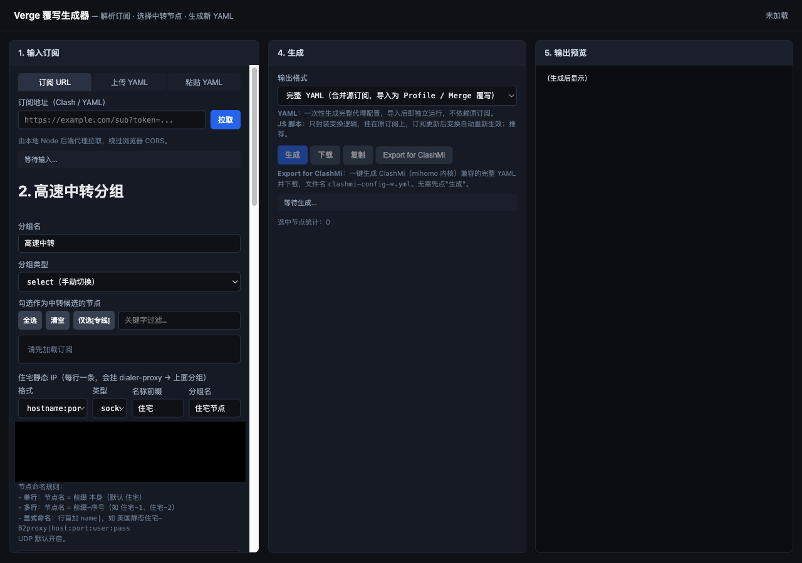
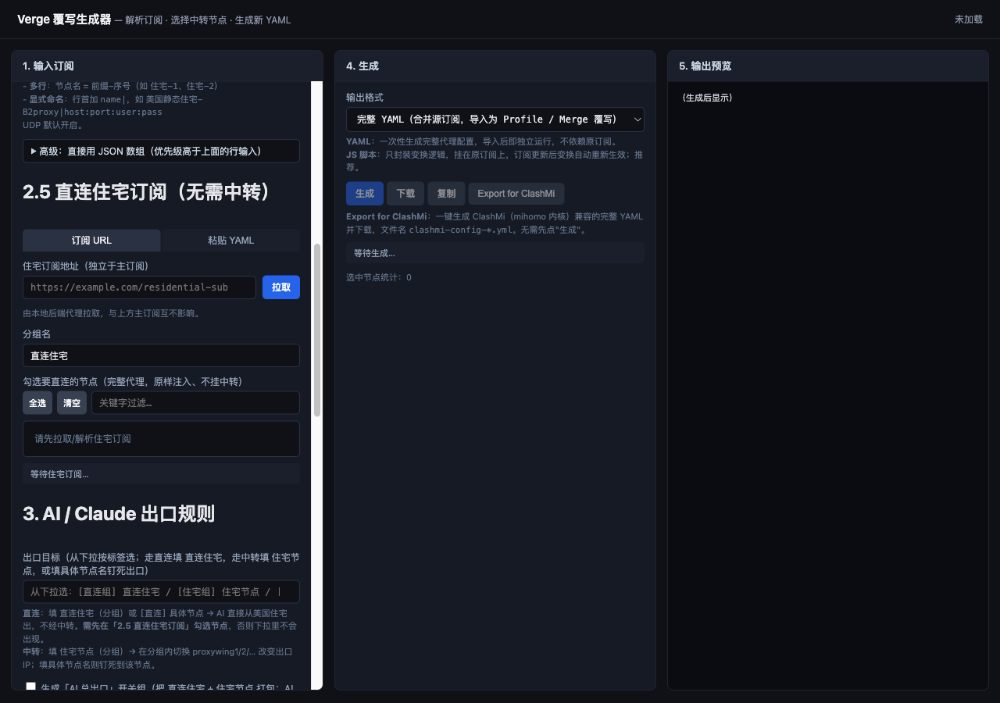
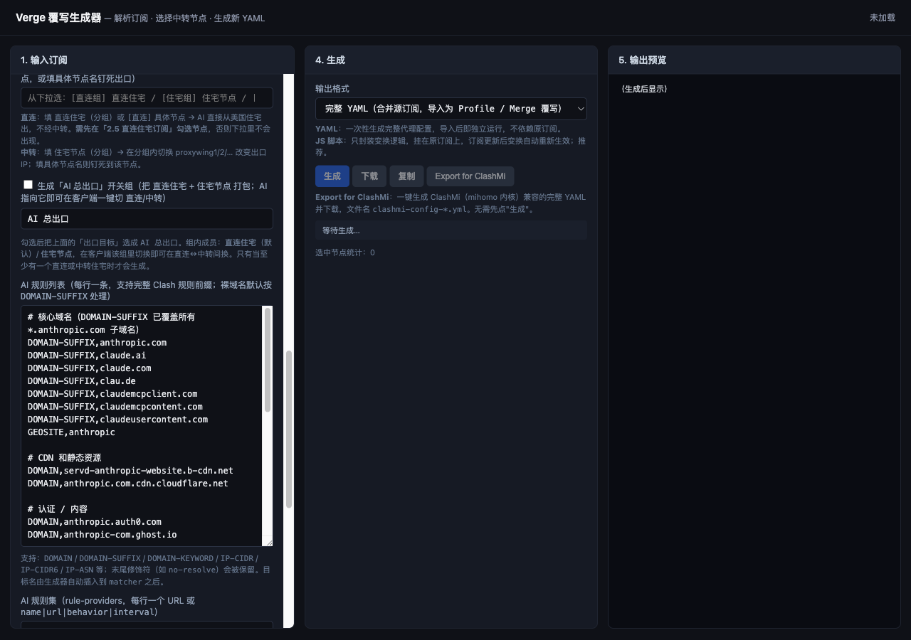
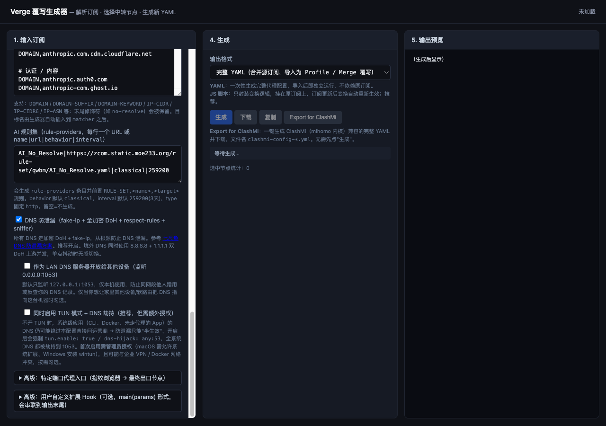
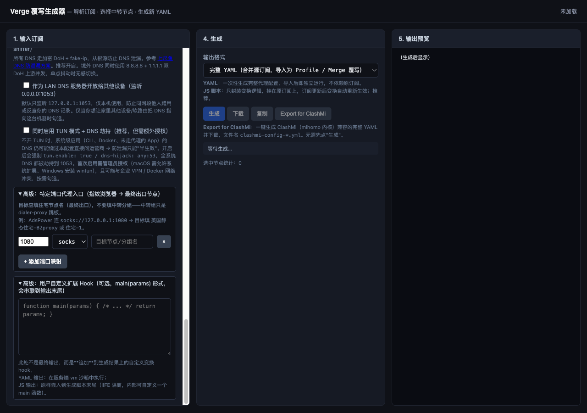
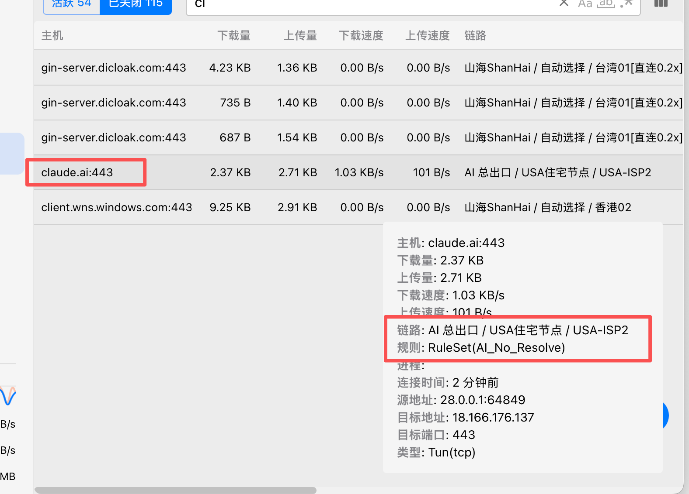
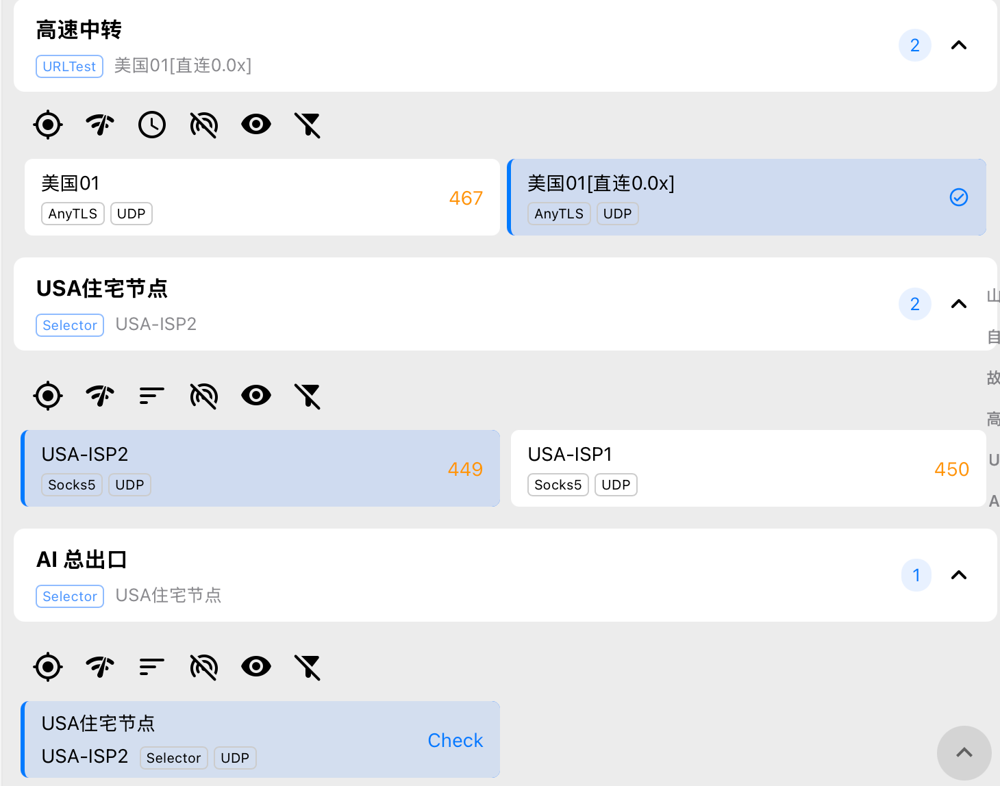
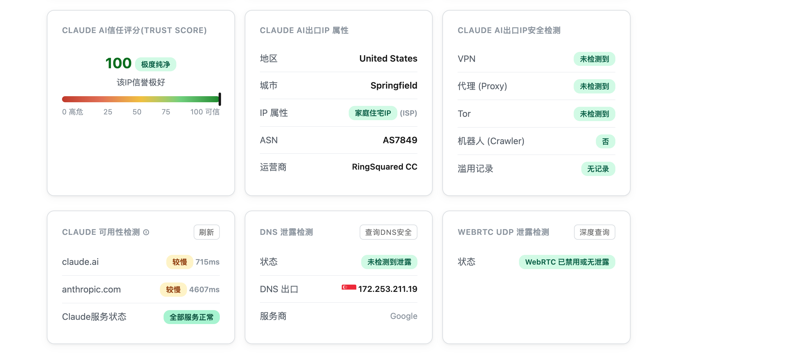

# verge-plugin

> **一句话：** 在网页上点几下，就把 Clash 订阅覆写成「让 AI / 指定流量从 **ISP 静态住宅 IP** 出口」的配置，输出可直接导入 Clash Verge 的 **YAML** 或 **JS 覆写脚本**。

写 Clash 的 `dialer-proxy`、`listeners`、AI 分流规则、DNS 防泄漏配置很繁琐，手改一次要半小时还容易出错。这个工具把这些**固化成可视化表单**——勾节点、填住宅 IP、选出口，剩下的 YAML 由它生成。

---

## 这个工具是用来干嘛的

**核心目的：方便、快捷地覆写「ISP 静态 IP 出口」。**

- 🏠 **把流量钉死到 ISP 静态住宅 IP 出口** —— 给 AI（Claude / ChatGPT 等）、指纹浏览器或指定端口，绑定一个干净的家庭宽带住宅 IP，避免机房 IP 被风控、频繁验证、封号。
- 🔁 **住宅 IP 不能直连？自动加跳板** —— 住宅节点自动挂 `dialer-proxy` 借道你选的「高速中转」分组出站，无需手写链式代理。
- 📜 **输出「扩展脚本」形式（推荐）** —— 生成的不是死配置，而是一段 `main(params)` JS 覆写脚本，**挂在原订阅上，订阅更新后自动重新生效**，无需每次重做。也支持完整 YAML 与 ClashMi 兼容格式。
- 🛡️ **顺手把 DNS 也堵上** —— 一键开启 fake-ip + 全加密 DoH + respect-rules，从根源防 DNS 泄漏。

> 简言之：**你负责勾节点、填住宅 IP；它负责把覆写脚本写好。**

---

## 适用场景

| 场景 | 怎么用 |
| --- | --- |
| **AI 服务走静态住宅 IP** | 把 `anthropic.com` / `claude.ai` 等 AI 域名出口指向住宅节点，IP 干净、信任分高、不易触发验证。 |
| **指纹浏览器独立出口** | 给 AdsPower 的本地端口（如 `socks://127.0.0.1:1080`）绑定专用住宅节点，做到**账号级流量隔离**。 |
| **住宅 IP 直连差 / 连不上** | 住宅节点借道「高速中转」分组出站，延迟更稳，无需手动配链式代理。 |
| **防 DNS / WebRTC 泄漏** | 开启 DNS 防泄漏（可选 TUN 全局劫持），AI 出口 IP 与 DNS 出口一致。 |

---

## 快速开始

需要 **Node 18+**（用到内置 `fetch`）。

```bash
cd verge-plugin
npm install
npm start
# 浏览器打开 http://127.0.0.1:7788
```

> 开发模式：`npm run dev`（文件变更自动重启）；运行测试：`npm test`。

---

## 项目结构

```text
verge-plugin/
├── src/                      后端 + 前端源码
│   ├── server.js             服务入口：Express 装配、托管 web/、挂载路由
│   ├── routes/
│   │   └── api.js            三个接口：/api/fetch、/api/parse、/api/generate
│   ├── lib/                  纯逻辑模块（与 HTTP 无关，易测试）
│   │   ├── subscription.js   订阅 Base64 解码 + 节点/分组摘要
│   │   ├── generate-yaml.js  生成完整 YAML / ClashMi 覆写
│   │   └── generate-script.js 生成 JS 覆写脚本（main(params) 形式）
│   └── web/                  浏览器前端（被 server.js 静态托管）
│       ├── index.html        页面结构
│       ├── app.js            前端交互逻辑
│       └── style.css         样式
├── test/                     接口测试（node:test，覆盖生成各路径）
├── docs/                     文档与截图
├── package.json
└── README.md
```

- **`src/web/` 就是"网页本身"**——浏览器直接访问的页面，不是后端代码。
- **`src/lib/` 是核心生成逻辑**——与 Express 解耦，路由层只负责收参、校验、分发。

---

## 界面操作说明

打开 `http://127.0.0.1:7788`，页面是三栏布局：**左栏配置**（步骤 1～3）、**中栏生成**（步骤 4）、**右栏预览**（步骤 5）。

> **最短路径**：① 输入订阅 → ② 勾中转节点 + 填住宅 IP → ③ 选 AI 出口 → ④ 生成 → 复制 / 下载导入。
> 顶部右上角「未加载 / 已加载 N 节点」是订阅加载状态指示。



### ① 输入订阅

三种方式任选其一：

- **订阅 URL**：填地址点「拉取」——由本地后端代理请求，自动绕过浏览器 CORS，并把 `User-Agent` 伪装成 clash。
- **上传 YAML**：选本地 `.yml / .yaml / .txt` 文件，选中即解析。
- **粘贴 YAML**：粘贴文本点「解析」。

解析成功后状态栏显示「N 节点 / M 分组」，并填充第 ② 步的节点列表。（支持 Base64 编码订阅，后端自动解码。）

### ② 高速中转分组 + 住宅静态 IP ⭐

这是「ISP 静态 IP 出口」的核心。先组一个中转池，再录入住宅 IP，住宅会自动挂 `dialer-proxy` 借道中转池出站。

**第一步，配高速中转分组：**

- **分组名**：默认 `高速中转`，住宅节点会自动 `dialer-proxy` 指向它。
- **分组类型**：`select`（手动切）/ `url-test`（自动测速）。
- **勾选中转候选节点**：工具栏支持「全选 / 清空 / 仅选 [专线] / 关键字过滤」。

**第二步，录入住宅静态 IP（每行一条）** —— 填入你的 ISP 静态住宅 IP：

| 字段 | 说明 |
| --- | --- |
| **格式** | `hostname:port:username:password` 或 `username:password:hostname:port` |
| **类型** | `socks5` / `http` |
| **名称前缀** | 默认 `住宅`，决定自动生成的节点名 |
| **分组名** | 默认 `住宅节点`，这些住宅会归入此 select 分组，方便切换 |

命名规则：

- **单行** → 节点名 = 前缀本身（如 `住宅`）
- **多行** → 节点名 = `前缀-序号`（如 `住宅-1`、`住宅-2`）
- **显式命名** → 行首加 `name|`，如 `美国住宅A|us.example.com:30000:user:pass`
- `#` 开头是注释，UDP 默认开启
- 折叠面板「高级：直接用 JSON 数组」可粘贴完整节点对象，优先级更高

### ②.5 直连住宅订阅（无需中转）

如果住宅本身**可以直连**、不需要跳板，用这里。它是**独立于主订阅**的第二份订阅，勾选的完整节点会原样注入、不挂中转。



- 子标签：**订阅 URL** / **粘贴 YAML**；分组名默认 `直连住宅`。
- ⚠️ **必须勾选**节点，被勾的代理才会注入，并出现在第 ③ 步「出口目标」下拉里。

### ③ AI / Claude 出口规则 ⭐

决定哪些流量走住宅出口、从哪个住宅出。



- **出口目标**：从下拉按标签选——
  - `[直连组] 直连住宅` / `[直连] 具体节点` → 直接从住宅出，不经中转
  - `[住宅组] 住宅节点` → 在组内切换具体住宅来换出口 IP
  - 填**具体节点名** → 把出口钉死到该节点
- **AI 总出口开关组**（可选）：把「直连住宅 + 中转住宅」打包成一个开关组（默认名 `AI 总出口`），客户端里一键切「直连 ↔ 中转」。
- **AI 规则列表**：已内置整套 Claude 域名 / IP-CIDR / GEOSITE 规则。支持 `DOMAIN` / `DOMAIN-SUFFIX` / `DOMAIN-KEYWORD` / `IP-CIDR` / `IP-CIDR6` / `IP-ASN` 等前缀，**裸域名**默认按 `DOMAIN-SUFFIX` 处理，末尾修饰符（如 `no-resolve`）保留。
- **AI 规则集（rule-providers）**：每行一个 URL 或 `name|url|behavior|interval`，生成 `rule-providers` 并前置 `RULE-SET` 规则。

**DNS 防泄漏**（默认开启，推荐）及其两个子选项见下图与 [DNS 防泄漏](#dns-防泄漏) 一节：



- └ **作为 LAN DNS 服务器开放**：默认只听 `127.0.0.1:1053`；勾选后听 `0.0.0.0:1053`，供同网段设备 / 软路由使用。
- └ **同时启用 TUN 模式 + DNS 劫持**：强制 `tun.enable + dns-hijack`，让 CLI / Docker 等系统级应用的 DNS 也无法绕过防泄漏。**首次需管理员授权**，可能与企业 VPN / Docker 冲突。

### 高级：端口映射 与 扩展 Hook 📜



- **特定端口代理入口**：点「+ 添加端口映射」，为本地端口绑定出口。
  例：AdsPower 连 `socks://127.0.0.1:1080`，目标填**住宅节点名**（最终出口，**不要填中转分组**）。生成 `listeners` + `IN-PORT` 规则。
- **用户自定义扩展 Hook**：追加一段 `main(params)` 形式的 JS 变换。YAML 输出时在服务端 vm 沙箱执行；JS 输出时原样嵌入脚本末尾（IIFE 隔离）。适合在生成结果上再做个性化改写。

### ④ 生成（中栏）

- **输出格式**：
  - `JS 覆写脚本`（**推荐**）—— 只封装变换逻辑，挂在原订阅上，**订阅更新后自动重算**。
  - `完整 YAML` —— 合并源订阅的完整配置，导入后独立运行、不依赖原订阅。
- 按钮：**生成** / **下载**（`.yml` / `.js`）/ **复制** / **Export for ClashMi**（一键导出 mihomo 兼容 YAML 并下载，无需先点生成）。
- 底部显示选中节点统计（中转 + 直连）。

### ⑤ 输出预览（右栏）

展示生成的 YAML / 脚本全文，核对无误后复制或下载导入。

---

## 输出格式：为什么推荐「扩展脚本」

| | JS 覆写脚本（推荐） | 完整 YAML | ClashMi YAML |
| --- | --- | --- | --- |
| 内容 | 仅 `main(params)` 变换逻辑 | 合并源订阅的完整配置 | mihomo 兼容完整配置 |
| 依赖原订阅 | 是，挂在原订阅上 | 否，独立运行 | 否 |
| **订阅更新** | **自动重新生效** | 需重新生成 | 需重新生成 |
| 导入类型 | Clash Verge **Script 覆写** | Profile / Merge 覆写 | ClashMi 配置 |
| 体积 | 小 | 大 | 大 |

> 「扩展脚本」最大的好处：**订阅的节点变了，你的覆写逻辑不用重做**——脚本会在每次订阅更新时自动套用。

---

## DNS 防泄漏

参考 [七尺鱼 DNS 防泄漏方案](https://github.com/qichiyuhub/rule/blob/main/config/mihomo/configdns.yaml)。启用后**整体替换**订阅里的 DNS 与 sniffer 配置，**全局生效**：

- **DNS**：`enhanced-mode: fake-ip`，nameserver 全走加密 DoH；境外用 `8.8.8.8` + `1.1.1.1` 双 DoH 并发，单点抖动无感切换。
- **respect-rules**：DNS 解析跟随路由规则——走代理的域名由代理端远程解析，直连域名走国内加密 DoH，杜绝泄漏。
- **sniffer**：HTTP / TLS / QUIC 嗅探，配合 fake-ip 还原真实目标域名。
- **fake-ip-filter**：排除不兼容 fake-ip 的域名（局域网发现、推送服务等）。

可选增强：**LAN DNS** 对外开放、**TUN 模式**全系统 DNS 劫持（见第 ③ 步）。

---

## 导入 Clash Verge

1. 第 ④ 步生成后，点 **复制** 或 **下载**。
2. 打开 Clash Verge → 订阅 / Profiles。
3. 按输出格式新建覆写：
   - **JS 脚本** → 在原订阅上新建 **Script 类型**覆写，粘贴脚本内容（推荐）。
   - **YAML** → 新建本地 Profile，或作为 Merge 覆写。
4. 启用覆写并切换到生成的配置。

---

## 核心概念

- **dialer-proxy 跳板链**：住宅节点不直接出站，先连「高速中转」组里某节点，再从住宅 IP 落地。中转组是「跳板」，住宅是「最终出口」。
- **中转住宅 vs 直连住宅**：前者借道中转组（住宅直连差时用），后者原样注入直接出站（住宅可直连时用）。
- **出口目标填谁**：想在多个住宅间切换 → 填**分组名**（`住宅节点` / `直连住宅` / `AI 总出口`）；想钉死出口 → 填**具体节点名**。**端口映射目标**应填住宅节点名，**不要填中转分组**。

---

## 安全提示

- 扩展脚本在**服务端 Node `vm` 沙箱**执行（3 秒超时），可访问 `params`。**仅本地 `127.0.0.1` 使用，切勿暴露到公网。**
- 订阅 URL 后端代理只转发 GET，`User-Agent` 伪装成 clash。
- 住宅 IP 账号密码会出现在生成结果 / 预览里，分享前请脱敏。

---

## 配置效果

导入生成的覆写后，Clash 客户端里会自动出现这几个分组：**美国高速中转**（中转池）、**住宅节点**（挂 `dialer-proxy` 的住宅出口）、**AI 总出口**（指向住宅节点的开关组）。



在「连接」里能看到分流真实生效——`api.anthropic.com:443`（Claude 流量）走 **AI 总出口 → 住宅节点 → ProxyStore2** 的住宅出口链路，而普通流量走 **美国高速中转 → 美国 01**，两条路径互不干扰：



## 验证结果

本地浏览器访问 <https://ip.net.coffee/claude>：AI 信任评分满分、出口为美国家庭住宅 IP、无 VPN/代理/Tor 特征、DNS 与 WebRTC 均无泄漏。


